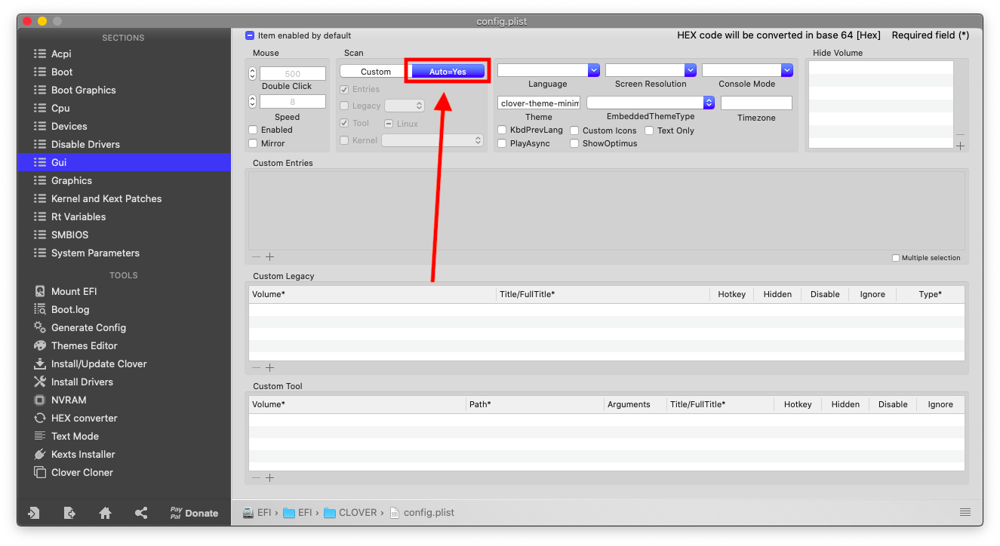

# Lenovo-Ideapad-320-14IKB (80XK)
A guide for installing macOS Catalina on Lenovo IdeaPad 320-14IKB (Kaby Lake-U)
(Check Tonymacx86 discussion from [here](https://www.tonymacx86.com/threads/guide-lenovo-ideapad-320-14ikb-clover-uefi-hotpatch.293387/)).

# Note 
I'm not an expert in hackintoshing, This is my first Hackintosh, I managed to get everything working in my machine, Your machine may be different than mine, Higher specs, Dedicated GPU, etc..., If it's so this guide may not work for you, So be careful and good luck!

# Laptop's Hardware 
- <b>CPU</b>: Intel i5 7200U Dual Core CPU (Kaby Lake-U)
- <b>GPU</b>: Intel HD 620 Graphics 
- <b>Storage</b>: 500GB WD Blue Solid State Drive & 2 TB Seagate Mobile (Upgraded)
- <b>RAM</b>: 12 GB DDR4 2133MHz (Upgraded)
- <b>Screen</b>: 13.9-inch Full HD (1920 x 1080)
- <b>Trackpad</b>: ELAN (I2C)
- <b>Wi-Fi</b>: Broadcom DW1560 (BCM94352Z) Dual Band M.2 Ngff WiFi Card (Upgraded)
- <b>Ports</b>: 1 x USB-C, 2 x USB 3.0,USB 2.0 SD Card Reader, HDMI Display Port, Ethernet Port

# Overview 
This laptop is a budget laptop, By these specs, You can't do some heavy work, Battery life is around 2-3 hours, Its good but not the best, If you want more you can choose higher specs, But consider that this guide may be different for your hardware.

# What's Working?
- Intel HD 620 Graphics full QE/CI 
- CPU power management 
- Realtek Ethernet 
- Battery (Cycles doesn't show properly)
- All ports (USB, Ethernet & HDMI)
- Realtek ALC230 Audio
- Wi-Fi & Bluetooth (including Apple services)
- Internal webcam with Facetime
- Trackpad (including gestures)
- Sleep (lid sleep and lid wake)
- Screen Brightness with hotkeys

# What's Not Working?
- Nothing

# Requirement 
- 8 GB USB Disk 
- macOS Catalina image downloaded from the Appstore 
- Mouse, Because trackpad won't work in the installation 

# BIOS Configuration
Before doing anything, Remember to update your BIOS to the latest version, Preparing your machine to macOS, Reboot your laptop, When the Lenovo logo's appear press <b>F2</b>, When the BIOS menu appears go to: 
- "Configuration" <b>SATA Controller Mode</b> to <b>AHCI</b>, <b>HotKey Mode</b> to <b>Enabled</b>.
- "Security" <b>Intel Platform Trust Technology</b> to <b>Disabled</b>, <b>Intel SGX</b> to <b>Disabled</b>, <b>Secure Boot</b> to <b>Disabled</b>.
- "Boot" <b>Boot Mode</b> to <b>UEFI</b>,<b>Fast Boot</b> to <b>Disabled</b>, <b>USB Boot</b> to <b>Enabled</b>.
- "Exit" <b>OS Optimized Defaults</b> to <b>Disabled</b>

# Installation
After downloading macOS from the Appstore, Format your USB drive as "Mac OS Extended (Journaled)", then open Terminal and type:
`sudo /Applications/Install\ macOS\ Catalina.app/Contents/Resources/createinstallmedia --volume /Volumes/MyVolume
`, And remember, `MyVolume` is for the name of your USB drive, You can change it if you would, After it's done, Mount the EFI partition in your USB, Copy-and-paste the folder `EFI` from this release's repository, Download Clover Configurator from [here](https://mackie100projects.altervista.org/clover-configurator/), Then change the SMBIOS to MacBookPro14,1 which is the closest one to this laptop's hardware, update your kexts and Clover Bootloader, (for more specific guide please go [here](https://hackintosh.gitbook.io/-r-hackintosh-vanilla-desktop-guide/)), After setting up your machine, unzip the folder `ALCPlugFix` and run `install.command`, this is gonna fix the static noise from your headphone after sleep, And you're ready to go!.

# Extras
- If you don't like the name of your machine that shown in "About This Mac", You can change it! Press Shift+Cmd+G (⇧⌘G) and copy-and-paste this path: `/Users/Username/Library/Preferences/com.apple.SystemProfiler.plist`, And remember, The word `Username` Is for your username, now download your favorite pilst editor (mine is "PilstEdit Pro"), Then you can change to `Lenovo IdeaPad 320-14IKB (80XK)` or any name you want.

- The key "PrtSc" can be remapped from disabling trackpad to take screenshots and record videos, In the ACPI folder, There's an SSDT (SSDT-PrtSC-F13) for remapping it to "F13", If you don't want to have this feature, You can delete it.

- Who needs CDs these days? You can buy this caddy and replace it with the CD Drive from [here](https://www.aliexpress.com/item/32850001303.html) to get dual drives.
- 4 GB of ram isn't enough these days, Unfortunately, It's built-in the motherboard, So the maximum is 12 GB, You can upgrade your RAM from [here](https://www.amazon.com/Corsair-2133-288-Pin-Memory-CMV8GX4M1A2133C15/dp/B00SV7IILC).
- The Wi-Fi card that shipped with this laptop is Intel Wi-Fi card, There's a kext for it under development which can be found [here](https://github.com/AppleIntelWifi/adapter), But for now, You can buy BCM94360CS2, an Apple wifi card for this laptop for less than 40$, these days, The DW1560 is quite expensive and it's not from Apple, Fortunately, I bought it before it becomes, If you want to buy it instead of the DW1560, You can delete all Wi-Fi and Bluetooth kexts from the EFI folder because it's natively supported in macOS, [The Wi-Fi Card](https://www.aliexpress.com/item/32637520988.html?trace=wwwdetail2mobilesitedetail&spm=a2g0s.9042311.0.0.5e204c4dWDlWnx), [The Adapter](https://www.aliexpress.com/item/4000300306817.html?trace=wwwdetail2mobilesitedetail&trace=wwwdetail2mobilesitedetail&spm=a2g0s.9042311.0.0.5e204c4dWDlWnx), [The Antenna](https://www.aliexpress.com/item/32862630916.html?trace=wwwdetail2mobilesitedetail&spm=a2g0s.9042311.0.0.5e204c4dWDlWnx).
- You can change the frequency of your CPU in config.plist as shown in the photo, without changing it, macOS will recognize it as 2.71 GHz for some reason. 

- You can change the name of your graphics like this, I chose the name `Intel HD Graphics 620 macOS Edition` you can choose whatever you want as shown in the photo.

- You can make your laptop boot's automatic to macOS if you don't have windows Installed as shown in the photos.

# Credits
- [Apple](https://www.apple.com) for macOS.
- [Acidanthera](https://github.com/acidanthera) for most of the kexts.
- [RehabMan](https://github.com/RehabMan) for some patches.
- [Sniki](https://github.com/Sniki) for some patches.
- [Moh_Ameen](https://github.com/ameenjuz) for some patches.
- [ImmersiveX](https://github.com/ImmersiveX) for the theme.
- And anyone else that helped to develop and improving hackintoshing.
