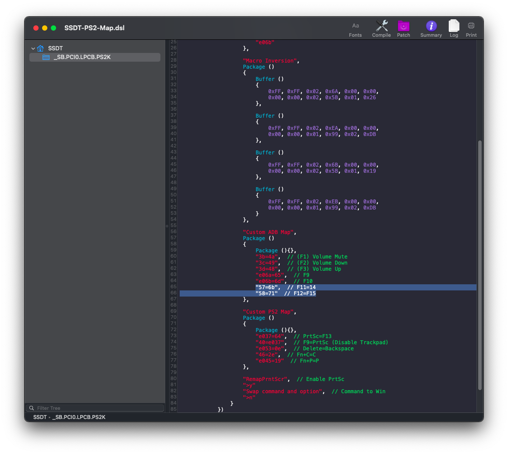

# Lenovo IdeaPad 320-14IKB (80XK) Hackitnosh 

A guide for installing macOS Catalina on Lenovo IdeaPad 320-14IKB using Clover and OpenCore UEFI hotpatch.

# Note 
I'm not an expert in hackintoshing, this is my first Hackintosh, I managed to get everything working in my laptop, your laptop may be different than mine, higher specifications, dedicated GPU, etc, it's not guaranteed to work a %100, if it's so then this guide may not work for you, be careful and good luck!

# Laptop's Hardware 
- <b>CPU</b>: Intel [i5 7200U](https://ark.intel.com/content/www/us/en/ark/products/95443/intel-core-i5-7200u-processor-3m-cache-up-to-3-10-ghz.html) Dual-Core CPU (Kaby Lake-U)
- <b>GPU</b>: Intel HD 620 Graphics 
- <b>Storage</b>: 500GB WD Blue Solid State Drive & 2TB Seagate Mobile Hard Drive (Upgraded)
- <b>RAM</b>: 12 GB DDR4 2133MHz (Upgraded)
- <b>Screen</b>: 13.9-inch Full HD (1920 x 1080)
- <b>Trackpad</b>: ELAN (I2C)
- <b>Wi-Fi</b>: Broadcom DW1560 (BCM94352Z) Dual Band M.2 Ngff WiFi Card (Upgraded)
- <b>Ports</b>: 1 x USB-C, 2 x USB 3.0,USB 2.0 SD Card Reader, HDMI Display Port, Ethernet Port

# Overview 
This laptop is a budget laptop, by these specs, you can't do some heavy work, battery life is around 2-3 hours, It's good but not the best, if you want more you can choose higher specs, but consider that this guide may be different for your hardware.

# What's Working?
- Intel HD 620 Graphics full QE/CI 
- CPU power management 
- Battery (Cycles doesn't show properly)
- All USB ports 
- HDMI port (including HDMI Audio)
- Realtek Ethernet port 
- Realtek ALC230 Audio (including headphones jack)
- Wi-Fi & Bluetooth (including Apple services)
- Internal webcam with Facetime
- ELAN Trackpad with GPIO mode (including gestures)
- Sleep (hibernation, lid sleep and lid wake)
- Native macOS Hibernation
- Screen Brightness with Hotkeys
- Fn keys and Hotkeys lock
- macOS 10.13 High Sierra, 10.14 Mojave, and 10.15 Catalina, Big Sur 11

# What's Not Working?
- Apple Pay, requires TouchID, more information [here](https://discussions.apple.com/thread/7808558)

# Bugs
- DRM support (iTunes Movies, Apple TV+, Amazon Prime and Netflix, and others) could be fixed in the future, more information [here](https://github.com/acidanthera/bugtracker/issues/586) and [here](https://www.tonymacx86.com/threads/an-idiots-guide-to-lilu-and-its-plug-ins.260063/#DRM).
- No sound if power unplugged or mic is being used after sleep, see https://github.com/Ab2774/Lenovo-IdeaPad-320-14-IKB-Hackintosh/issues/2.
- Microphone doesn't work in Chrome or Firefox, see https://github.com/Ab2774/Lenovo-IdeaPad-320-14-IKB-Hackintosh/issues/3.
- Lowest brightness, in real Macs, the lowest brightness turns the screen completely black, however, `AppleBacklightSmoother` Kext doesn`t support this feature yet.
- Screen light-up after wake, in `Big Sur` a second keyboard click is required to light up the screen, this can be fixed but it will break sleep causing instant wake.

# Requirement 
- 16GB USB drive 
- macOS Big Sur image downloaded from the Appstore 
- ~Mouse, because trackpad won't work in the installation~ Fixed with VoodooI2C v2.4

# BIOS Configuration
Before doing anything, make sure to update your BIOS to the latest version from [here](https://pcsupport.lenovo.com/us/en/products/laptops-and-netbooks/300-series/320-14ikb/downloads/ds121587), preparing your laptop to macOS, reboot your laptop, when the Lenovo logo appears press <b>F2</b>, when the BIOS menu appears go to: 
- "Configuration" <b>SATA Controller Mode</b> to <b>AHCI</b>, <b>HotKey Mode</b> to <b>Enabled</b>.
- "Security" <b>Intel Platform Trust Technology</b> to <b>Disabled</b>, <b>Intel SGX</b> to <b>Disabled</b>, <b>Secure Boot</b> to <b>Disabled</b>.
- "Boot" <b>Boot Mode</b> to <b>UEFI</b>,<b>Fast Boot</b> to <b>Disabled</b>, <b>USB Boot</b> to <b>Enabled</b>.
- "Exit" <b>OS Optimized Defaults</b> to <b>Disabled</b>.

# Installation
After downloading macOS Big Sur from the AppStore (do not use a distro image like Hackintosh Zone otherwise it's gonna break your system and you won't get any support using it), format your USB drive as "Mac OS Extended (Journaled)", then open Terminal and type: `sudo /Applications/Install\ macOS\ Big\ Sur\.app/Contents/Resources/createinstallmedia --volume /Volumes/MyVolume`, and remember, `MyVolume` is for the name of your USB drive, you can change it if you would, mount the EFI partition in your USB, Copy-and-paste the folder `EFI` from this release's repository, unzip `SMBIOS Generator`, open Terminal and drag-and-drop macserial to the terminal window, then type `--generate-all`  and press<kbd> enter</kbd>, then copy MacBookPro14,1 SMBIOS (which is the closest one to this laptop's hardware) and change it, copy to both Clover's config.plist and OpenCore's config.plist, update your kexts and Clover Bootloader or OpenCore (if a new update is available), reboot your laptop and press `F12` to enter `BIOS Menu`, choose your USB installer and boot from it, you should see the `Clover Boot Menu`, boot from the USB that shown, it may take some time to boot, after is done, you should see `macOS Utilities`, choose `Disk Utility` and erase the drive you want to install macOS on it, click on `Erase` and type the name that you want, like: "Macintosh HD", choose the format as `APFS` and `Scheme` as `GUID Partition Map` and click `Erase`, after it's done, close the window and go back to `macOS Utilities` and choose `Install macOS`, click `Agree` to accept the license agreement, the installation should starts now, your laptop should restarts several times, after it's done, login to your AppleID (for more specific guide please go [here](https://dortania.github.io/oc-laptop-guide/)), after setting up your laptop, unzip the folder, (please delete CodecComannder and ALCPlugFix as they're no longer required with AppleALC 1.5.4), if you have problems with sleep please go [here](https://dortania.github.io/oc-laptop-guide/battery-power-management/correcting-sleep-problems.html)
restart, and you're ready to go!

# Extras
- After you finish the installation you'll notice that your iMessage and other Apple services aren't working properly, to fix that issue you have to add `ROM`, `MLB` and a proper SMBIOS (which is MacBookPro14,1 for this device) in your `config.plist`, for more information follow this guide from [here](https://dortania.github.io/OpenCore-Post-Install/universal/iservices.html#fixing-imessage-and-other-services-with-opencore).
- If you have an SSD installed, you can enable TRIM support on it, just enable this option in your `config.plist` and enjoy! (consider that it may slow booting a bit for APFS formatted SSDs, more information about TRIM [here](https://en.wikipedia.org/wiki/Trim_(computing))
Clover:

OpenCore:

- If you're a Synaptics trackpad user, your trackpad is supported! Just enable these options that can be found in `Extras` folder in this repository realeses to your `config.plist` and copy `VoodooI2CSynaptics.kext` to `Kexts` or `kexts/Other` folder.
- If you don't like the name of your laptop that shown in "About This Mac", you can change it! Press Shift+Cmd+G <kbd>⇧⌘G</kbd> and copy-and-paste this path: `/Users/Username/Library/Preferences/com.apple.SystemProfiler.plist`, and remember, the word `Username` Is for your username, now download your favorite plist editor (mine is "PilstEdit Pro"), then you can change to `Lenovo IdeaPad 320-14IKB (80XK)` or any name you want.

- Fn keys don't work usually on most hackintoshes, luckily, `YogaSMC` can fix this! Not just enabling Fn keys and their abilities, it enables Lenovo features like `Conversation Mode` to stop charging the battery at %60 to increase it's age, ture Cycle Count reading because macOS ones can be wrong, `Fn Mode` etc, to get those features, `YogaSMC` is included inside the EFIs, all you have to do is install `YogaSMCNC` app and `YogaSMCPane` which are included in the release.
- The keyboard experience on this laptop is a bit different than a real mac, in order to make the closest to a real mac we need to make a couple of changes, luckily, in the latest `VoodooPS2` release, it automatically swaps <kbd>Cmd</kbd> to <kbd>Win</kbd>, if you want to reverse it, use `SSDT-Swap-Alt-Cmd` (or swap them in `System Preferences` as shown in the photo), to prevent <kbd>PrtSc</kbd> from disabling trackpad we need to remap it as <kbd>F13</kbd> (can be remaped to take screenshots and record videos as shown in the photo) and remap <kbd>F6</kbd> as <kbd>PrtSc</kbd> to disable trackpad, to make <kbd>Delete</kbd> key working like a real Mac we need to remap it as <kbd>Backspace</kbd>, `BrightnessKeys` Kext automatically remaps brightness keys without any ACPI requirements, if your brightness keys are <kbd>F11</kbd> and <kbd>F12</kbd>, please remove these two lines using MaciASL which can be found [here](https://github.com/acidanthera/MaciASL) as they are not required and will affect brightness keys in `Fn Mode`, then compile it and replace it, if your brightness keys are <kbd>F14</kbd> and <kbd>F15</kbd>, you're good to go! If you want to use all keyboard patches, there's an SSDT that combines them all which is `SSDT-PS2-Map`, please avoid using all of them to prevent having a `Kernel Panic`.

- Who needs CDs these days? You can buy this caddy and replace it with the CD Drive from [here](https://www.aliexpress.com/item/32850001303.html) to get dual drives.
- 4GB of ram isn't enough these days, Unfortunately, 4GB is built-in the motherboard, so the maximum is 12GB, you can upgrade your RAM to 12GB total from [here](https://www.amazon.com/Corsair-Module-2133MHz-Unbuffered-SODIMM/dp/B0143UM6Y0/ref=sr_1_6?dchild=1&keywords=8+ram+2133&qid=1585516185&s=electronics&sr=1-6).
- The Wi-Fi card that shipped with this laptop is probably an Intel Wi-Fi card which can be fixed with `itlwm` Kext which can be found [here](https://github.com/OpenIntelWireless/itlwm), please check all supported cards before buying from [here](https://openintelwireless.github.io/itlwm/Compat.html), there's another option which is buying a Broadcom Card like DW1560 and DW1830, please check all supported cards before buying from [here](https://dortania.github.io/Wireless-Buyers-Guide/unsupported.html), or you can buy an Apple Wi-Fi Card like BCM94360CS2, [The Wi-Fi Card](https://www.aliexpress.com/item/32637520988.html?trace=wwwdetail2mobilesitedetail&spm=a2g0s.9042311.0.0.5e204c4dWDlWnx), [The Adapter](https://www.aliexpress.com/item/4000300306817.html?trace=wwwdetail2mobilesitedetail&trace=wwwdetail2mobilesitedetail&spm=a2g0s.9042311.0.0.5e204c4dWDlWnx), [The Antennas](https://www.aliexpress.com/item/32862630916.html?trace=wwwdetail2mobilesitedetail&spm=a2g0s.9042311.0.0.5e204c4dWDlWnx).
- You can change the frequency of your CPU in `config.plist` as shown in the photo, without changing it, macOS will recognize it as 2.71 GHz for some-reason. 

- You can change the name of your graphics like this, I chose the name `Intel HD Graphics 620 macOS Edition` you can choose whatever you want as shown in the photo.
Clover:

OpenCore:

- If your RAM information isn't shown properly in `System Report` you can fix that by adding it to your `Clover's` `config.plist`.

- You can make your laptop boots automatically to macOS if you don't have another OS installed as shown in the photos, type your drive's name, check `Fast`, now your laptop should boot automatically to macOS without the `Clover Boot Menu`

- In OpenCore it's a bit different, disable `ShowPicker` and open `System Preferences`, `Startup Disk`, type your password, choose the disk that you boots from, and restart, if you want it to boot normally, press <kbd>Esc</kbd> in the startup menu, to show other disks and tools press <kbd>Space</kbd>, make sure to do this when you're done installing macOS and troubleshooting, in case you needed to boot to `Preboot` or reset `NVRAM` etc.

- You can get the famous Mac-Chime when booting! By enabling these two options in your `config.plist` and copy `AudioDxe.efi` from `Extras` folder in this repository realeses to `Drivers` folder, but consider that it may slow your booting a bit.

- If you want to get these options to choose the resolution like this you can! by running this command which can be found [here](https://github.com/xzhih/one-key-hidpi), type your password and choose the numbers 1,3,1 then restart.

- If you don't like the default Clover you can change it! Search the web and choose your favorite theme, copy-and-paste it to `themes` in `EFI` folder, then go to your `config.plist`, `GUI` section, `Theme` and type the name of your theme, you can use `Clover OSS Theme`, which looks like a real Mac boot-up screen. 

# Credits
- [Apple](https://www.apple.com) for macOS.
- [Acidanthera](https://github.com/acidanthera) for most of the kexts.
- [RehabMan](https://github.com/RehabMan) for some ACPI patches.
- [Steve Zheng](https://github.com/stevezhengshiqi) for some patches.
- [zhen-zen](https://github.com/zhen-zen) for YogaSMC.
- [Hiep Bao Le](https://github.com/hieplpvip) for AppleBacklightSmoother
- [Sniki](https://github.com/Sniki) for some patches.
- [daliansky](https://github.com/daliansky) for some ACPI patches.
- [Moh_Ameen](https://github.com/ameenjuz) for some ACPI patches.
- [blackosx](https://github.com/blackosx/OpenCanopyIcons) for OpenCanopyIcons theme.
- [al3xtjames](https://github.com/al3xtjames) for clover-theme-oss theme.
- [ImmersiveX](https://github.com/ImmersiveX) for clover-theme-minimal-dark theme.
- And anyone else that helped to develop and improve hackintoshing.
