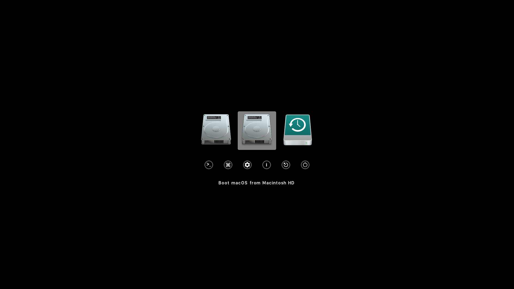
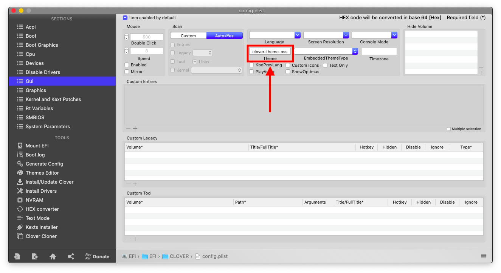

# Clover OSS Theme
[](https://github.com/al3xtjames/clover-theme-oss/releases)

Mac-style theme for Clover (originally by [lisai9093](https://github.com/lisai9093)).



# Installation
Download the release ZIP file of this repository to your Clover theme directory (usually
in EFI/CLOVER/themes, located on the EFI system partition). Then, edit your
Clover config.plist to select the theme.




````plist
<key>GUI</key>
<dict>
	<key>Theme</key>
	<string>clover-theme-oss</string>
</dict>
````

# Credits
- [Apple](https://www.apple.com) for macOS.
- [al3xtjames](https://github.com/al3xtjames) for the original theme.
- The original theme by [lisai9093](https://github.com/lisai9093).
- The Yosemite-style Windows volume icon is from [here](http://atopsy.deviantart.com/art/Boot-Camp-Assistant-for-OS-X-Yosemite-Re-Upload-500410985).
- And anyone else that helped to develop and improve hackintoshing.

